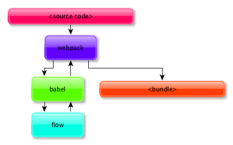

# boilerplate-webpack-flowtype

> :ledger: Test project about how to setup FlowType

## How it's works?



## How to use `FlowType`?

1. Install dependencies

    ```json
    {
        "scripts": {
            "run": "node bundle.js",
            "build": "webpack"
        },
        "devDependencies": {
            "babel-core": "^6.14.0",
            "babel-loader": "^6.2.5",
            "babel-plugin-syntax-flow": "^6.13.0",
            "babel-plugin-tcomb": "^0.3.12",
            "babel-plugin-transform-flow-strip-types": "^6.14.0",
            "babel-preset-es2015": "^6.14.0",
            "tcomb": "^3.2.13",
            "webpack": "^1.13.2"
        }
    }
    ```

2. Define Babel plugins:

    ```json
    {
        "presets": [
            "es2015"
        ],
        "plugins": [
            "syntax-flow",
            "tcomb",
            "transform-flow-strip-types"
        ]
    }
    ```

3. Define `webpack` settings

    ```javascript
    'use strict';

    module.exports = {
        entry: './index.js',
        output: {
            filename: 'bundle.js'
        },
        module: {
            loaders: [
                {
                    test: /^(.*)\.js$/,
                    exclude: /node_modules/,
                    loader: 'babel-loader'
                }
            ]
        }
    };
    ```

4. Last, but not least add your code:

    ```javascript
    /* @flow */

    'use strict';

    function Person(name: string) {
        this.name = name;
    }

    let p = new Person('asd');
    console.log(p);
    ```

5. Run commands:

    ```bash
    $ npm run build   # build ES5 file from ES6 + FlowType
    $ npm run run     # execute ES5 code
    ```

## License

[The MIT License](http://piecioshka.mit-license.org) @ 2016
